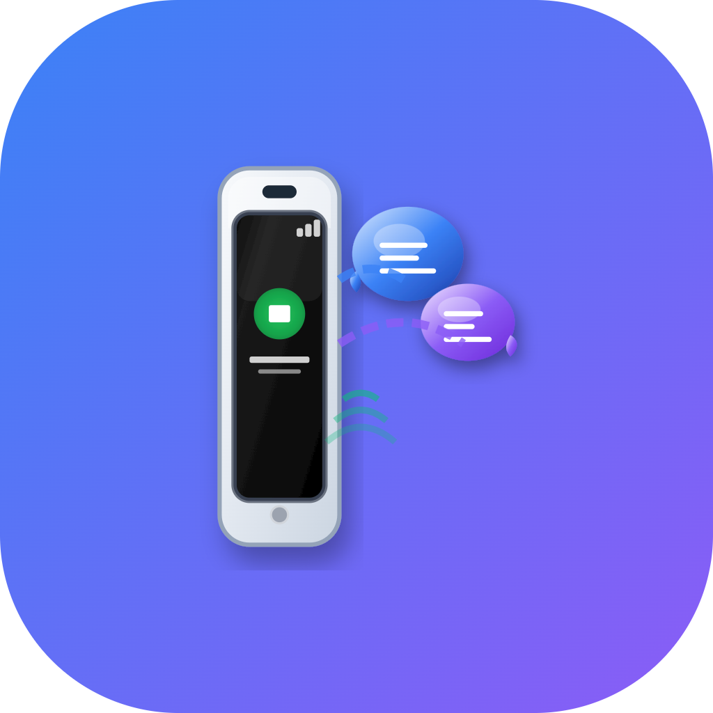

<p align="center">
  
</p>

<h1 align="center">VoIP Call Tester 📞🎥</h1>

<p align="center">
  <strong>Voice and Video Call Testing Application</strong><br>
  A powerful and lightweight tool to test VoIP audio and video call features.<br>
  Built for developers, testers, and network engineers.
</p>

---

## 🚀 Features

- ✅ Voice Call Testing (SIP protocol)
- ✅ Video Call Support
- ✅ Echo Test Capability
- ✅ Real-time Audio/Video Stats Monitoring
- ✅ SIP Registration and Account Management
- ✅ Network Quality Simulation (NAT, STUN, TURN support)
- ✅ Call Logging and Debugging Tools
- ✅ Cross-platform (Android/iOS/Web planned)

---

## 📱 Use Cases

- Test and debug SIP voice/video calls.
- Validate server-side VoIP setups (e.g., Kamailio, Asterisk, FreeSWITCH).
- Perform real-world audio/video quality testing across networks.
- Demonstrate VoIP features in training or demos.

---

## 🛠️ Tech Stack

- 🧱 **Framework**: Native Android (Java/Kotlin) / iOS (Swift) [in progress]
- 🔈 **Media Stack**: PJSIP / Linphone SDK
- 📡 **Protocol**: SIP, RTP, SRTP, STUN/TURN/ICE
- 📦 **Build System**: Gradle, CMake (NDK for Android)
- ☁️ **Deployment**: GitHub Releases, Firebase (optional)

---

## 🖼️ Screenshots

> Coming Soon! (Add images from your app interface here)

---

## 🧪 How to Build

### Android

```bash
git clone https://github.com/usamahisam/tilfun.git
cd voip-call-tester
./gradlew assembleDebug
